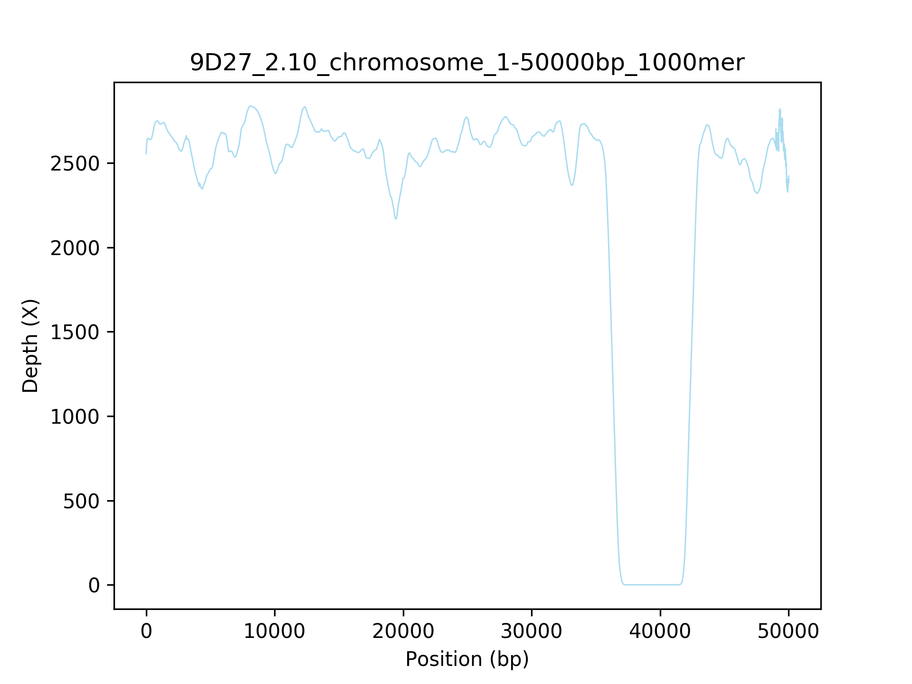

## Scripts backup for Flow-cell biofilm project

plot_sam_depth.py
---

        # plot depth for a specified region of a contig
        $ python ~/PycharmProjects/FlowCellBiofilm/plot_sam_depth.py -r 2.10wt_illumina.fasta -d 9D27.depth -i 2.10_plasmid1 -s 2000 -e 10000 -k 100

        # plot depth for the full length of one specified contig in the reference file
        $ python ~/PycharmProjects/FlowCellBiofilm/plot_sam_depth.py -r 2.10wt_illumina.fasta -d 9D27.depth -i plasmid1 -k 1000

        # plot depth for the full length of all contigs in the reference file
        $ python ~/PycharmProjects/FlowCellBiofilm/plot_sam_depth.py -r 2.10wt_illumina.fasta -d 9D27.depth -k 1000

