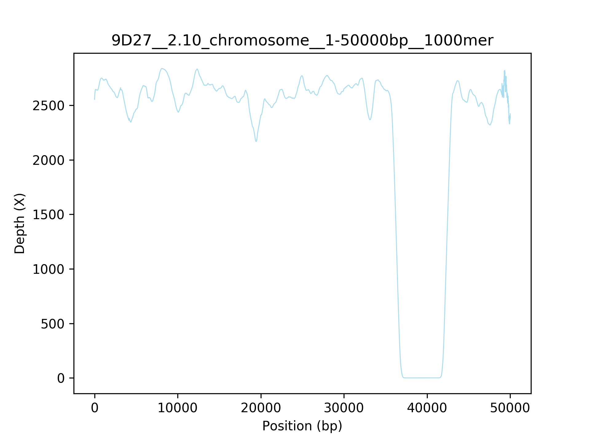

## Scripts backup for Flow-cell biofilm project

### 1. plot_sam_depth.py

Format of image title: (bam file)\_\_(contig id)\_\_(starting bp to plot)-(ending bp to plot)\_\_(average depth of k-mer)

        # get depth file from bam file
        $ samtools depth 9D27.bam > 9D27.depth

        # plot depth for a specified region of a reference sequence
        $ python ~/PycharmProjects/FlowCellBiofilm/plot_sam_depth.py -r 2.10wt_illumina.fasta -d 9D27.depth -i 2.10_plasmid1 -s 2000 -e 10000 -k 100

        # plot depth for the full length of a specified reference sequence
        $ python ~/PycharmProjects/FlowCellBiofilm/plot_sam_depth.py -r 2.10wt_illumina.fasta -d 9D27.depth -i plasmid1 -k 1000

        # plot depth for the full length of all reference sequences in bam file
        $ python ~/PycharmProjects/FlowCellBiofilm/plot_sam_depth.py -r 2.10wt_illumina.fasta -d 9D27.depth -k 1000

